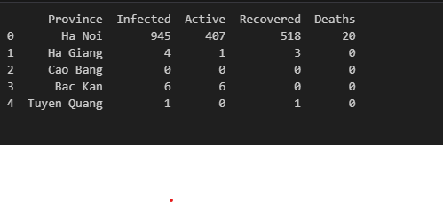
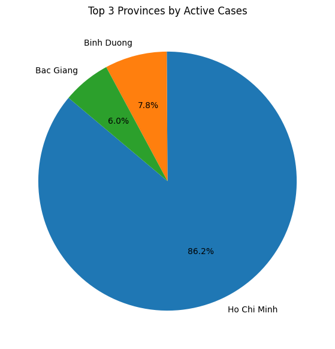

# Project for assignment Data-Analysis

1 Display data from a csv file

2 cleaning data

3 Virtally province infected cases

4 virtually province top-3 infected cases

5 Virtally province active covid-19

6 virtually province top-3 active covid-19

7 Virtally by province that recovered from covid-19 

8 virtually province top-3 infected cases

9 Virtally by province that death from covid-19

10 virtually province top-3 death from covid-19

11 Virtually detial covid-19 in Map, follow by province in Vietnam

12 Virtually detial covid-19 in Map, follow by province Ha Noi

